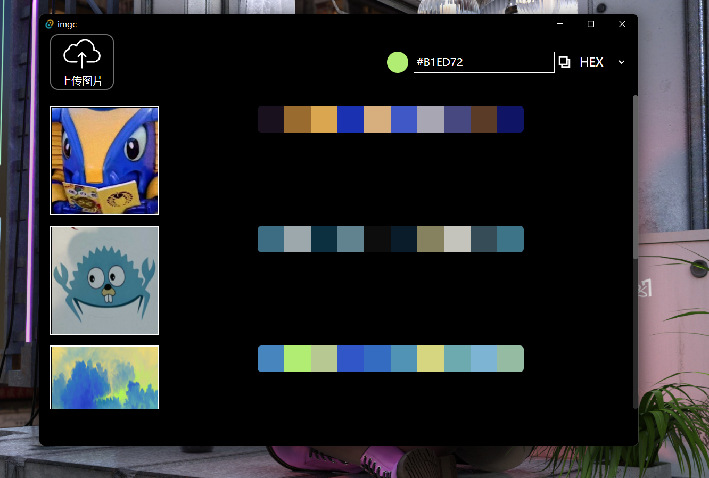

# <p align="center">imgc 🖼️🎨</p>

<p align="center">✨一个基于 Tauri + Vue 开发的图片主色彩提取软件 ( 跨平台 )</p>

支持的格式:
- jpg/jpeg
- png
- ico

---



## 💻 开发环境

需要安装[Rust](https://www.rust-lang.org/tools/install)环境

```
# 安装依赖
npm install

# 运行网页
npm run dev

# 运行Tauri
npm run d
```
